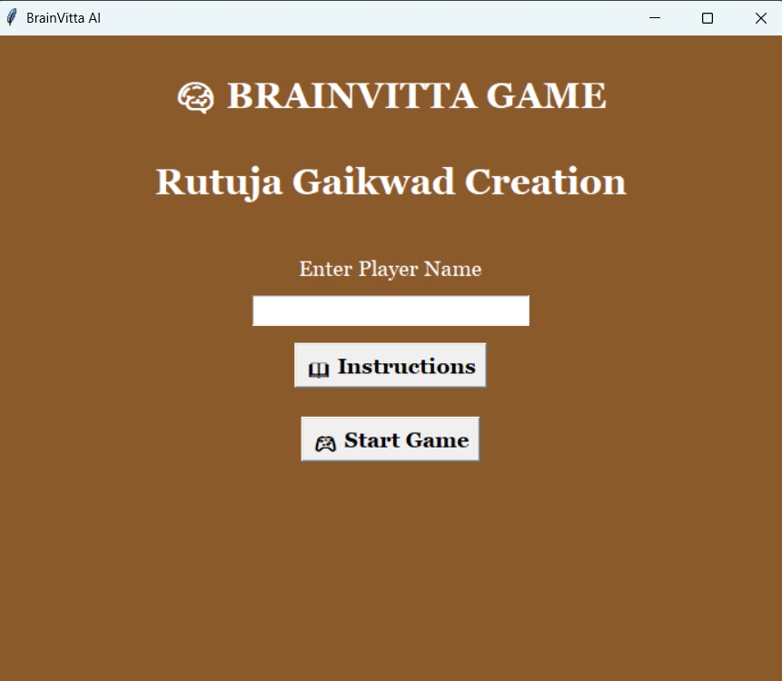

# BrainVitta AI

BrainVitta (Peg Solitaire) puzzle game built with Python and Tkinter.

## Features

* Interactive GUI
* Restart Button
* Undo Button
* AI Hint System
* Timer
* Score Tracking
* Best Score Saving

## Author

Rutuja Gaikwad

## Screenshots

### Screenshot 1

### Screenshot 2
.png)